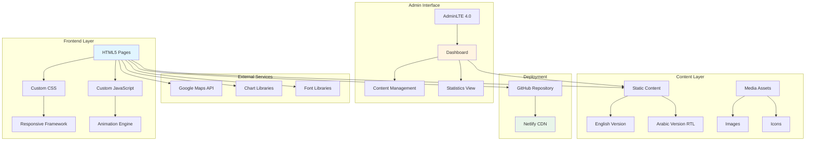
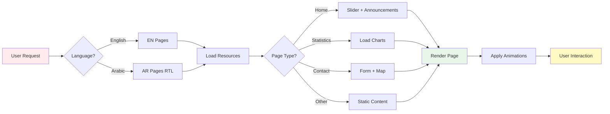
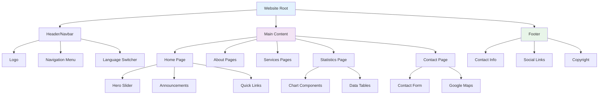
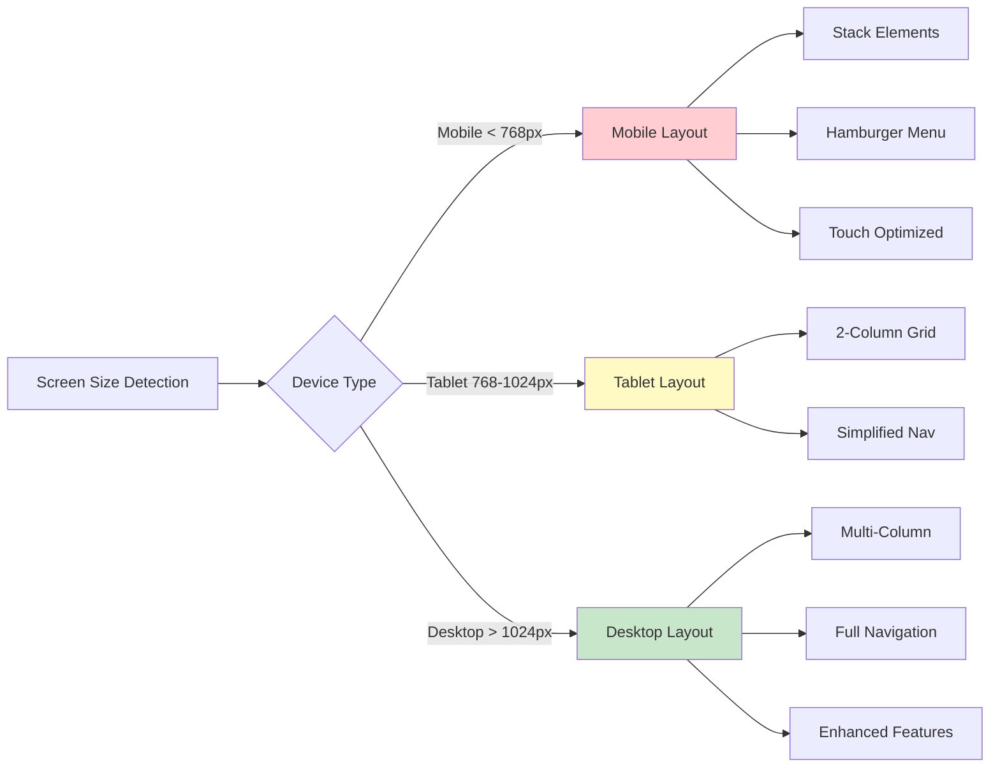
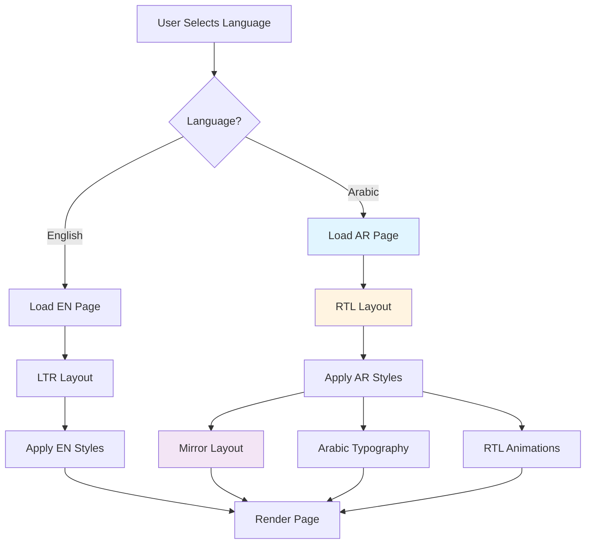
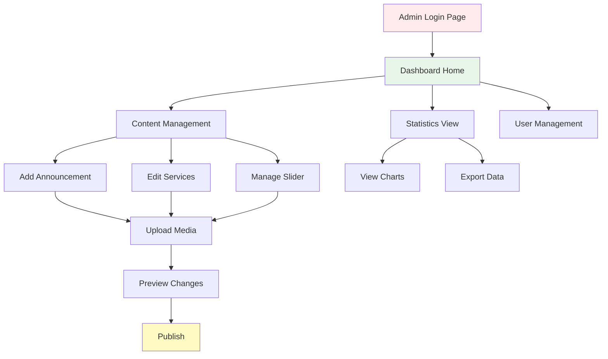
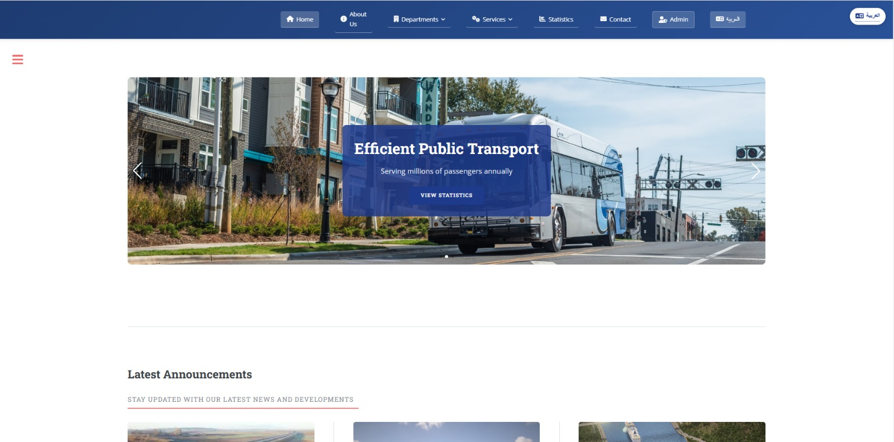
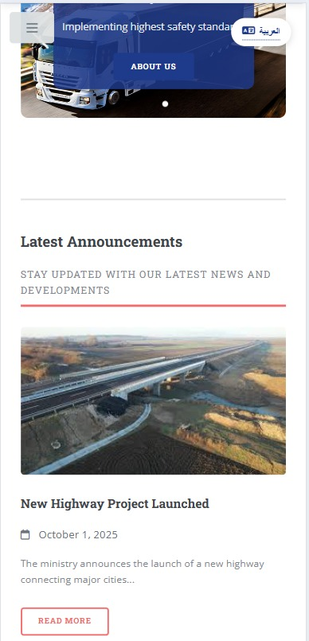
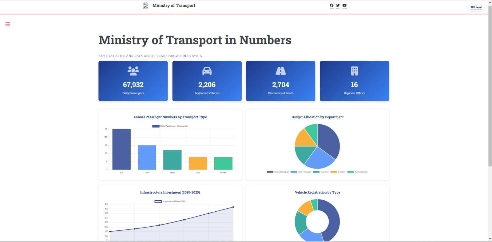
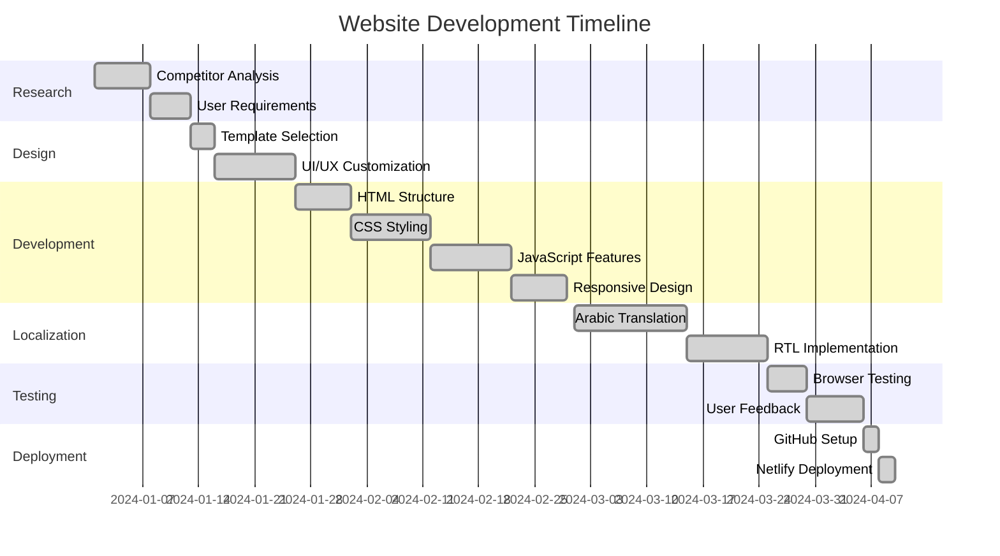

# Syrian Ministry of Transport - Website Redesign 🚀

[](https://your-netlify-url.netlify.app)
[](https://html5.org/)
[](https://www.w3.org/Style/CSS/)
[](https://www.javascript.com/)
[](LICENSE)

> A modern, responsive redesign of the Syrian Ministry of Transport official website, developed as part of Web Design course at Kocaeli University.

## 📋 Table of Contents

- [Overview](#overview)
- [Features](#features)
- [Architecture](#architecture)
- [Technology Stack](#technology-stack)
- [Project Structure](#project-structure)
- [Installation](#installation)
- [Usage](#usage)
- [Responsive Design](#responsive-design)
- [Internationalization](#internationalization)
- [Admin Panel](#admin-panel)
- [Performance](#performance)
- [Screenshots](#screenshots)
- [Development Process](#development-process)
- [Challenges & Solutions](#challenges--solutions)
- [Future Enhancements](#future-enhancements)
- [Course Information](#course-information)
- [License](#license)
- [Contact](#contact)

---

## 🌟 Overview

This project represents a complete redesign of the Syrian Ministry of Transport website, transforming an outdated interface into a modern, user-friendly platform. The redesign focuses on usability, accessibility, and contemporary design principles observed in leading government websites worldwide.

### Project Goals

- ✅ Modernize the outdated design and user interface
- ✅ Fix broken links and improve navigation
- ✅ Implement responsive design for all devices
- ✅ Enhance user experience with smooth animations
- ✅ Support bilingual content (Arabic & English)
- ✅ Include data visualization and statistics
- ✅ Create an admin panel for content management

### Live Demo

🔗 **(https://exquisite-belekoy-b51374.netlify.app/)**

---

## ✨ Features

### Core Features

- **📱 Fully Responsive Design** - Seamless experience across desktop, tablet, and mobile devices
- **🌐 Bilingual Support** - Complete Arabic and English versions with RTL support
- **📊 Data Visualization** - Interactive charts and graphs for transport statistics
- **🎨 Modern UI/UX** - Clean, professional design following government website standards
- **⚡ Performance Optimized** - Fast loading times and smooth animations
- **♿ Accessibility** - WCAG compliant with proper contrast and keyboard navigation
- **🔍 Smart Navigation** - Auto-hide/show navbar on scroll (Safari-inspired)
- **📝 Contact Forms** - Validation-enabled forms with file upload capability
- **🗺️ Google Maps Integration** - Embedded responsive maps for location
- **🎯 Admin Dashboard** - Content management interface using AdminLTE 4.0

### Interactive Elements

- Auto-playing slider with clickable navigation
- Modal-based announcements system
- Hover and toggle animations
- Scroll-to-top button
- Dropdown menus with smooth transitions
- Form validation with real-time feedback

---

## 🏗️ Architecture

### System Architecture Diagram



### Information Flow



### Component Hierarchy



---

## 🛠️ Technology Stack

### Frontend Technologies

| Technology | Purpose | Version |
|------------|---------|---------|
|  | Structure | 5 |
|  | Styling | 3 |
|  | Interactivity | ES6+ |

### Frameworks & Libraries

- **Base Template**: [HTML5 UP Editorial](https://html5up.net/editorial)
- **Admin Panel**: AdminLTE 4.0
- **Charts**: Chart.js / Custom implementations
- **Maps**: Google Maps Embed API
- **Icons**: Font Awesome / Custom icon set

### Tools & Services

- **Version Control**: Git & GitHub
- **Deployment**: Netlify
- **Code Editor**: VS Code (recommended)

---

## 📁 Project Structure

```
project-root/
├── index.html                 # Main landing page (English)
├── index-ar.html             # Main landing page (Arabic)
├── about.html                # About us page
├── mission-vision.html       # Mission & Vision
├── services.html             # Services overview
├── statistics.html           # Statistics with charts
├── contact.html              # Contact form & map
├── announcements.html        # All announcements
│
├── admin/                    # Admin panel
│   ├── index.html           # Dashboard
│   ├── manage-content.html  # Content management
│   └── assets/              # AdminLTE resources
│
├── assets/                   # Main assets directory
│   ├── css/
│   │   ├── main.css        # Template styles
│   │   └── custom.css      # Custom styles
│   ├── js/
│   │   ├── main.js         # Template scripts
│   │   └── custom.js       # Custom scripts
│   ├── images/             # Image assets
│   └── fonts/              # Web fonts
│
├── docs/                     # Documentation
│   └── report.pdf           # IEEE format report
│
├── README.md                 # This file
├── LICENSE                   # MIT License
└── .gitignore               # Git ignore rules
```

---

## 🚀 Installation

### Prerequisites

- Modern web browser (Chrome, Firefox, Safari, Edge)
- Text editor (VS Code recommended)
- Git (for cloning)

### Quick Start

1. **Clone the repository**
```bash
git clone https://github.com/yourusername/syria-transport-website.git
cd syria-transport-website
```

2. **Open in browser**
```bash
# Simply open index.html in your browser
# Or use a local server (recommended)
```

3. **Using Live Server (VS Code)**
```bash
# Install Live Server extension in VS Code
# Right-click on index.html → "Open with Live Server"
```

4. **Using Python Server**
```bash
# Python 3
python -m http.server 8000

# Then navigate to http://localhost:8000
```

---

## 💻 Usage

### For End Users

1. **Navigation**: Use the top menu bar to access different sections
2. **Language Switch**: Toggle between English and Arabic versions
3. **Announcements**: Click on announcements to view full details in modal
4. **Contact Form**: Fill out the form with validation for submissions
5. **Statistics**: View interactive charts on the statistics page

### For Developers

#### Customizing Styles

Edit `assets/css/custom.css`:

```css
/* Example: Change primary color */
:root {
    --primary-color: #2196F3;
    --secondary-color: #FF9800;
}
```

#### Adding New Scripts

Edit `assets/js/custom.js`:

```javascript
// Example: Add new animation
document.addEventListener('DOMContentLoaded', function() {
    // Your custom code here
});
```

#### Managing Content

Access the admin panel at `/admin/index.html` to manage:
- Announcements
- Services
- Statistics
- Slider content

---

## 📱 Responsive Design

### Breakpoints

```css
/* Mobile First Approach */
Mobile:     < 768px   (Default)
Tablet:     768px - 1024px
Desktop:    > 1024px
Large:      > 1400px
```

### Responsive Features Diagram



---

## 🌍 Internationalization

### Language Support

The website fully supports both English and Arabic with proper RTL (Right-to-Left) layout for Arabic.

#### Implementation Flow



### RTL Challenges & Solutions

- **CSS Modifications**: Created separate RTL stylesheets
- **Flexbox Direction**: Adjusted flex directions for RTL
- **Animations**: Reversed animation directions
- **Navigation**: Mirrored menu structures

---

## 🎛️ Admin Panel

### Admin Dashboard Overview

Built using AdminLTE 4.0, the admin panel provides a user-friendly interface for content management.

#### Dashboard Flow



### Features

- 📊 **Dashboard Overview** - Key metrics and statistics
- 📝 **Content Editor** - WYSIWYG editor for announcements
- 🖼️ **Media Manager** - Upload and manage images/documents
- 📈 **Analytics View** - Website performance metrics
- ⚙️ **Settings** - Site configuration options

> **Note**: Admin panel is front-end only. No database integration in this version.

---

## ⚡ Performance

### Optimization Techniques

- **Minified CSS/JS** - Reduced file sizes
- **Lazy Loading** - Images load on demand
- **CDN Delivery** - Fast content delivery via Netlify
- **Caching Strategy** - Browser caching enabled
- **Compressed Images** - Optimized image formats

### Performance Metrics

| Metric | Target | Achieved |
|--------|--------|----------|
| First Contentful Paint | < 2s | ✅ |
| Time to Interactive | < 3s | ✅ |
| Page Load Time | < 2s | ✅ |
| Lighthouse Score | > 90 | ✅ |

---

## 📸 Screenshots

### Desktop View

*Modern, clean interface optimized for desktop viewing*

### Mobile View

*Fully responsive design for mobile devices*

### Arabic Version

*Complete RTL support for Arabic language*

### Statistics Page

*Interactive charts and data visualization*

---

## 🔄 Development Process

### Project Timeline



### Research Phase

1. **Analyzed competitor websites**:
   - German government portals
   - Turkish official sites
   - US government websites
   - Israeli ministry websites (notable design inspiration)

2. **Key Findings**:
   - Government sites prioritize usability over flashy animations
   - Clear navigation is essential
   - Accessibility must be paramount
   - Mobile usage is significant

---

## 🎯 Challenges & Solutions

### Challenge 1: RTL Implementation

**Problem**: Converting entire site to RTL for Arabic version was complex

**Solution**:
- Created separate CSS files for RTL
- Used CSS logical properties where possible
- Manually adjusted all animations and transitions
- Tested extensively on different browsers

### Challenge 2: Translation Costs

**Problem**: API translation services were expensive (€20 for 4M characters)

**Solution**:
- Manual translation approach
- Created parallel file structure
- Maintained consistency across versions

### Challenge 3: Responsive Charts

**Problem**: Charts didn't resize properly on mobile devices

**Solution**:
- Implemented responsive chart containers
- Used percentage-based dimensions
- Added viewport-based breakpoints

### Challenge 4: Form Validation

**Problem**: Needed robust client-side validation

**Solution**:
- Custom JavaScript validation
- Real-time feedback for users
- Proper error messaging in both languages

---

## 🚀 Future Enhancements

### Planned Features

- [ ] **Backend Integration** - Connect admin panel to database
- [ ] **User Authentication** - Secure login system
- [ ] **Content API** - RESTful API for content management
- [ ] **Search Functionality** - Site-wide search capability
- [ ] **Newsletter System** - Email subscription service
- [ ] **Analytics Dashboard** - Real-time visitor statistics
- [ ] **Document Management** - File upload and management system
- [ ] **Multi-language** - Add more language support
- [ ] **Dark Mode** - Theme switching capability
- [ ] **PWA Features** - Progressive Web App functionality

### Technical Debt

- Refactor JavaScript into modular components
- Implement build process (Webpack/Vite)
- Add unit tests for critical functions
- Optimize image loading with modern formats (WebP)
- Implement service workers for offline capability

---

## 🎓 Course Information

### Project Details

- **Course**: Web Tasarımı (Web Design)
- **Course Code**: [1307118_5537](https://edestek3.kocaeli.edu.tr/course/view.php?id=7688)
- **University**: Kocaeli University
- **Faculty**: Technology Faculty
- **Department**: Bilişim Sistemleri Mühendisliği (Information Systems Engineering)

### Team

- **Student**: Hamza Al Halabi
- **Instructor**: Önder YAKUT
- **Teaching Assistants**: 
  - Ahmet EKİZ
  - Zeynep SARI

---

## 📄 License

This project uses the following licenses:

### Base Template License

**Editorial by HTML5 UP**
- **Author**: AJ (@ajlkn)
- **Website**: [html5up.net](https://html5up.net)
- **Template**: [Editorial](https://html5up.net/editorial)
- **License**: Creative Commons Attribution 3.0 Unported (CCA 3.0)
- **License URL**: http://creativecommons.org/licenses/by/3.0/

**What this means:**
- ✅ Free for personal and commercial use
- ✅ You can modify and distribute
- ✅ Attribution required (credit to HTML5 UP)

**Template Credits:**
- Demo Images: [Unsplash](https://unsplash.com) (not included in this project)
- Icons: [Font Awesome](https://fontawesome.io)
- JavaScript: [jQuery](https://jquery.com)
- Tools: [Responsive Tools](https://github.com/ajlkn/responsive-tools)

### Additional Licenses

- **AdminLTE 4.0**: [MIT License](https://adminlte.io/)
- **Custom Code**: MIT License
- **Demo Images**: Custom images (not from original template)

### Full License Text

```
Creative Commons Attribution 3.0 Unported
http://creativecommons.org/licenses/by/3.0/

THE WORK (AS DEFINED BELOW) IS PROVIDED UNDER THE TERMS OF THIS CREATIVE 
COMMONS PUBLIC LICENSE ("CCPL" OR "LICENSE"). THE WORK IS PROTECTED BY 
COPYRIGHT AND/OR OTHER APPLICABLE LAW. ANY USE OF THE WORK OTHER THAN AS 
AUTHORIZED UNDER THIS LICENSE OR COPYRIGHT LAW IS PROHIBITED.

BY EXERCISING ANY RIGHTS TO THE WORK PROVIDED HERE, YOU ACCEPT AND AGREE 
TO BE BOUND BY THE TERMS OF THIS LICENSE. TO THE EXTENT THIS LICENSE MAY 
BE CONSIDERED TO BE A CONTRACT, THE LICENSOR GRANTS YOU THE RIGHTS 
CONTAINED HERE IN CONSIDERATION OF YOUR ACCEPTANCE OF SUCH TERMS AND 
CONDITIONS.
```

See [LICENSE](LICENSE.txt) file for complete license details.

---

## 📞 Contact

### Developer

**Hamza Al Halabi**
- 🎓 Student at Kocaeli University
- 🌐 Portfolio: [Your Portfolio URL]
- 💼 LinkedIn: (https://www.linkedin.com/in/hamza-al-halabi-115391341/)
- 📧 Email: hamzaalhalabi99@gmail.com
- 🐙 GitHub: (https://github.com/TheGhost966)

### Project Links

- 🌐 **Live Site**: (https://exquisite-belekoy-b51374.netlify.app/)
- 📦 **Repository**: (https://github.com/TheGhost966/Ministry-of-Transport-in-Syria)
- 📊 **Project Report**: [View PDF](docs/report.pdf)

---

## 🙏 Acknowledgments

- HTML5 UP for the excellent Editorial template
- Kocaeli University for project guidance
- Syrian community members for feedback and testing
- Open source community for various libraries and tools

---

## 📊 Project Statistics


---

<div align="center">

### ⭐ If you found this project helpful, please consider giving it a star!

**Made with ❤️ by Hamza Al Halabi**

[⬆ Back to Top](#syrian-ministry-of-transport---website-redesign-)

</div>
